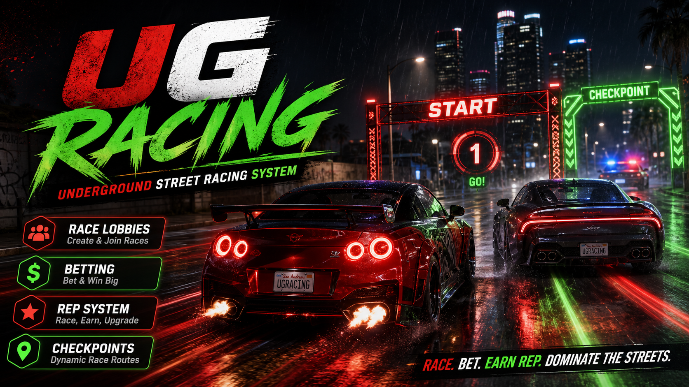

# ug-racing



Underground Street Racing System for FiveM standalone servers. This resource adds a hidden race organizer, reputation-gated routes, race lobbies, entry fees, prize pools, checkpoints, race HUD, leaderboards, police tools, and spike strips.

## Dependencies

- `ox_lib`
- `ox_target`

Optional:

- `ox_inventory` for real cash item entry fees and prize payouts when `Config.Economy.enabled = true`.

## Installation

1. Place the `ug-racing` folder inside your server resources directory.
2. Install and start `ox_lib` and `ox_target` before this resource.
3. Add these lines to `server.cfg`:

   ```cfg
   ensure ox_lib
   ensure ox_target
   ensure ug-racing
   ```

4. Configure race routes, reputation rewards, cooldowns, vehicle classes, timeouts, and economy settings in `config.lua`.
5. Restart the server, or run:

   ```cfg
   refresh
   ensure ug-racing
   ```

## Commands

- `/leaverace` - Leave your current lobby or active race.
- `/policeradio` - Open the police street-racing tools menu.
- `/scanraces` - Scan for active or starting street races and set GPS to a detected race.
- `/spike` - Deploy a spike strip at your current position.
- `/removespike` - Remove your active spike strip.

## Features

- Hidden race organizer NPC with `ox_target` interaction.
- `ox_lib` context menus and notifications.
- Reputation-gated race routes.
- Create and join race lobbies.
- Ready-up flow with host-controlled race start.
- Configurable entry fees, prize pools, and reputation rewards.
- JSON-backed reputation persistence.
- Race countdown, HUD, checkpoint progress, speed display, and results UI.
- Clean checkpoint blip and GPS route handling.
- Race spam cooldowns.
- Server-side distance validation for race interactions.
- Server-side vehicle class validation.
- Race timeout handling.
- Duplicate finish and payout protection.
- Police race scanning tools.
- Spike strip deployment and hit validation.
- ESC key handling for menus and NUI.

## Credits

BLDR
